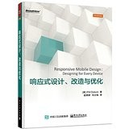

# 书名：响应式设计、改造与优化
>   
>
>英文名：Responsive Mobile Design: Designing for Every Device   
>作者：（美）Phil Dutson  
>评分：6.0/10.0

***

## 第1章

## 第2章

## 第3章

## 第4章

## 第5章 使用测量单位
  这章一共介绍4类测量单位，分别为像素、百分比、em和rem单位、viewport测量。

  - 使用像素
    像素为web中使用最早的一种测量单位，在web中一个像素就是屏幕上的一个点，

  - 使用百分比

  - 使用em和rem单位

  - viewport测量

## 第6章 使用媒体查询

  - **link标签中设置**  
    在link标签中设置属性media值，比如  

    ```html
    <script rel="stylesheet" type="text/css" href="a.css" media="screen">  
    <script rel="stylesheet" type="text/css" href="b.css" media="print">
    ```

  - **viewport meta标签**  
    设置viewport meta标签，一般是为了解决在移动端中界面的显示。viewport meta标签的确实会导致在移动端小屏幕上显示不全。格式为：

    ```html
    <!--
    content中可以设置如下值：
      width：设置viewport的宽度，device-width指根据浏览器宽度来设置宽度；
      initial-scale：初始化页面的缩放比例；
      maximum-scale：允许用户设置最大的放大比例；
      minimum：允许用户设置最小的缩小比例；
      user-scalable：是否允许用户缩放，默认为yes。
    -->
    <meta name="viewport" content="width=device-width, initial-scale=1.0">
    ```

  - **使用媒体查询**  
    首先是兼容性：ie9以下不支持媒体查询。不过可以引入一些polyfill来解决。


## 第7章
## 第8章
## 第9章
## 第10章
## 第11章
## 第12章
## 第13章
## 第14章
## 第15章
## 第16章
