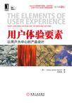
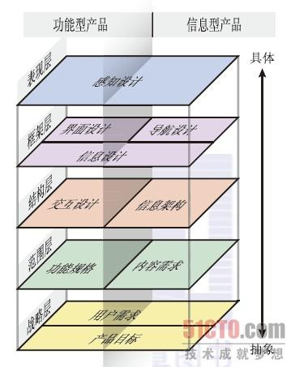

# 书名：用户体验要素
>   
>
>英文名：The Elements of User Experience   
>作者：（美）Jesse James Garrett  
>评分：9.0/10.0

***

## 第1章 用户体验为什么如此重要  
  - **什么是用户体验**
    用户体验不是指意见产品本身是如何工作的，它是指“产品如何与外界发生联系并发挥作用”，也就是人们如何“接触”和“使用”它。  

  - **为体验而设计：使用第一**  
  产品在设计的过程中，需要将用户体验纳入到考虑范围，这样才能保证产品以用户的使用为第一标准。  

  - **用户体验就是商机**  
  良好的用户体验可以吸引用户多次访问你的网站，提高“用户的忠诚度”，同时也会提高投资回报率。通过**转换率**和**流量变现**使你的网站的价值得到体现。  

  - **在乎你的用户**  
  创建吸引人的、高效的用户体验的方法称为“以用户为中心的设计”。用户为中心的设计思想非常简单：在开发产品的每一个步骤中，都要把用户列入考虑范围。为什么用户体验对你很重要，其中一个最大的理由就是：它对你的用户很重要。

## 第2章 认识这些要素
  -  **五个层面**  
    战略层、范围层、结构层、框架层、表现层五个层面。  

  - **自下而上的建设**  
    我们在设计用户体验要素时，从框架的最下层开始，逐渐向上设计。越往上越具体，同时考虑的因素也越多，所以每一层设计并不是完全独立的，下一层的设计决定了上一层的思路，上一层的变化也影响着下一层的修改，每相邻的两层都会相互影响。  

  - **基本的双重性**  
    网站的用户体验在发展的过程中遇到了两种不同的看法，一种是基于传统的桌面和客户端软件的角度来考虑，认为网站应分类为应用程序；另外一种是基于信息的发布和检索来考虑，认为网站应分类为信息资源里。这两种考虑其实都包含了网站的特性，所以网站是具有基本的双重性的产品：  
    ***功能性产品***：关注的是任务，去解决用户如何完成一个任务的过程。  
    ***信息型产品***：关注的是信息，提供给用户一个可以寻找、理解，且有意义的信息组合。  

  - **用户体验的要素**  
    包括五个要素：战略层、范围层、结构层、框架层、表现层。  

      

    ***战略层***：包括用户需求、产品目标。  
    ***范围层***：包括功能规格、内容需求。  
    ***结构层***：包括交互设计、信息构架。  
    ***框架层***：包括界面设计、导航设计、信息设计。  
    ***表现层***：包括感知设计。  

  - **应用这些要素**  
    网站的五个要素在应用的过程是相互交叉和相互影响的，合理应用这些要素，需要不断的实践和探索。不过还有两个方面非常值得关注的：  
    ***内容***：永远记得“内容至上”的原则，无论什么时候，内容才是用户最想要的东西。  
    ***技术***：技术是手段，越来越多的好的技术在改变用户体验，同样，用户体验也影响着技术的发展方向。

## 第3章 战略层
  战略层关注两个问题：用户需求、产品目标。  
  - **用户需求**：指用户在网站中需要得到什么。  
      在分析用户需求时，可以采用不同方法去搜集用户的需要的东西，比如用户细分、市场调研（调查问卷、用户访谈）、用户测试、模拟角色等等。  

  - **产品目标**：指公司或者开发者希望网站能够实现什么样的功能。  
    产品目标一般就是指要达到的商业目的，品牌知名度等等，设立相应的成功标准用来衡量即可。

## 第4章 范围层  
  范围层主要是拟定系统需要的过程，根据战略层中提出的“用户需要什么”和“我们需要什么”这两个问题，来明确系统中应该实现的范围。了解并撰写需求说明书是一份麻烦的工作，不过对于团队的开发方向具有很明显的指导作用，知道应该开发什么，不应该开发什么，什么需求的优先级高，距离目标还有多远等。同时也避免了在开发过程中频繁改变需求，增加功能的累赘。这其中主要关注两个问题：功能规格、内容需求。  

  - **功能规格**：对产品的“功能组合”的详细描述。  
    功能规格通常指产品应该实现的功能定义，不要求多，但是要求清楚和准确。将要实现的功能记录下来，并把握好**乐观**（be positive）、**具体**（be specific）、**避免主观语气**（avoid subjective language）这三个原则。  

  - **内容需求**：对各种内容元素的要求的详细描述。  
    内容需求定义了在你的系统中需要考虑的内容范围。这个内容范围包括了呈现给用户的所有信息，所以你的考虑内容的字数的多少，是否有图片，内存占比，文档格式（pdf）等一系列问题，同时，对于反馈给用户的信息，比如警告框、提示框、校验错误提示等，都需要有一个统一的设计和规范。可以将这些任务分配给一个人负责，这样责任划分更加明确，同时也更容易维护。

## 第5章 结构层  
  结构层旨在规划整体系统了，范围层中提到的需求，开始在结构层中呈现出来。在这个过程中，系统的结构设计需要根据软件开发的特点来处理，而不能完全依照需求的定义。结构层中主要关注两个问题：交互设计、信息构架。  

  - **交互设计**：定义系统如何响应用户的请求。  
    在交互设计中要选择用户熟悉的交互的方式，选择合适的**概念模型**，避免出现过度的比喻化产品。同时，在错误处理方面，力求避免出现错误，或者很难出现错误；若无法避免出现错误，则应该提供让用户可以自我解决的方案。  

  - **信息构架**：合理安排内容元素以促进人类理解信息。  
    信息构架需要考虑结构化内容、组织原则、统一的话语体系。**结构化内容** 指你如何设计你的信息结构，一般联合采用从上至下和从下至上的设计原则，然后再考虑结构方法（层级结构、矩阵结构、自然结构、线性结构）。组织原则指根据需求的不同**截面**，来划分组织构成，比如体育类网站可以分篮球、足球、羽毛球等，门户类网站可以分为国内新闻、国外新闻等。统一的话语体系指在系统中只要涉及到相同的概念，用统一的词语来表示，这个统一的话语体系应该体验在界面、注释、数据库字段等各个层面。

## 第6章 框架层
  框架层是结构层的包装，通过这种包装，再参考用户的习惯和事物的比喻，提供给用户一个更加直观、更加合理的界面和系统。在框架层的设计中，要利用**线框图**统一功能和信息。这部分主要关注三个问题：界面设计、导航设计、信息设计。  

  - **界面设计**：让用户与系统的功能产生互动的界面元素。  
    界面设计要突出每个页面想要表达的东西，通过板块设计、组件选择等方式让我们需要用户了解的东西变的一目了然，能够使用户在很舒服的状态下得到自己想要的东西。

  - **导航设计**：屏幕上的元素的组合，允许用户在信息构架中穿行。  
    导航设计不仅仅是导航条那么简单，它包含了各种方式，不过导航设计首先要达到三个目标：第一个是它必须提供给用户一种在网站件跳转的方法；第二个是导航设计必须传达出这些元素和它们所包含内容之间的关系。第三个是导航设计必须传达出它的内容和用户当前浏览页面之间的关系。  
    ***全局导航***：全局的导航条；  
    ***局部导航***：页面中的下一条、上一条、返回等；  
    ***辅助导航***：侧边栏导航；  
    ***上下文导航***：文本中的超链接、锚点；  
    ***友好导航***：快捷通道、友情链接；  
    ***网站地图***：网站的一个结构地图；  
    ***索引表***：书本应用的较多。

  - **信息设计**：促进理解的信息的表达方式。  
    信息设计包含两块，一个是指示信息，一个是数据的组织与分类。指示信息提供用户在什么位置，可以去哪里，最常见的是就是“当前位置”；数据的组织与分类提供用户更加清楚的数据形态，比如注册时人的各种信息要如何分配到基本信息、联系信息中。

## 第7章 表现层
  表现层关注于感知设计，其实这部分涉及就是视觉设计师的范畴了，这部分强调色彩搭配和设计原则。  
  - **色彩搭配**：突出重点，避免混乱。  

  - **设计原则**：crap设计原则。  
  crap设计原则分别为对比（contrast）、重复（repeation）、对齐（alignment）、亲密性（proximity）。

## 第8章 要素的应用
  在设计用户的体验时，必须同时考虑这5个层面的全部要素，大量的收集亟待解决的非常细微的问题，常常要“了解你正在试着去解决的问题”、“了解这些解决办法所造成的后果”。  

  - **提出正确的问题**  
    对于你即将面临的问题要有正确的心态。不要在用户体验问题上敷衍了事，多去考虑用户觉得这个网站怎么样，而不是用户对这个网站接受度有多高。理想的状态应该是“比用户自己更准确地区理解他们的需求”。  

  - **马拉松和短跑**  
  设计用户体验的过程是一场马拉松，在每个阶段都处理很多细小的问题。在5个要素层面中，下一层的失误会导致上一层的工作毫无意义，上一层的失误可能导致用户的丢失，所以每一层都至关重要。始终从完整的用户体验出发，那么最后得到的网站就是一份有价值的资产。
